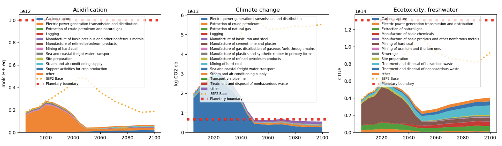

<p style="center">

</p>


# pathways

``pathways`` is a Python package that characterizes
environmental impacts of energy systems and transition scenarios using
Life Cycle Assessment (LCA).

``pathways`` is a work in progress. It reads in
scenarios and corresponding premise-generated LCA databases,
and calculates the environmental impacts over a defined period.

## Installation

``pathways`` is in an early development stage, and
can be installed from the Github repo  with ``pip``:

```bash

  pip install git+https://github.com/polca/pathways.git

```


## Usage

``pathways`` is a Python package, and can be used in Python scripts
or in a Python interpreter.

### Python

```python

from pathways import Pathways
p = Pathways(datapackage="sample/datapackage.json")
p.calculate(
    methods=[
            "EF v3.1 - acidification - accumulated exceedance (AE)"
        ],
    years=[2080, 2090, 2100],
    regions=["World"],
    scenarios=["SSP2-Base", "SSP2-RCP26",]
)

```

The argument `datapackage` is the path to the datapackage.json file
that describes the scenario and the LCA databases -- see dev/sample.
The argument `methods` is a list of methods to be used for the LCA
calculations. The argument `years` is a list of years for which the
LCA calculations are performed. The argument `regions` is a list of
regions for which the LCA calculations are performed. The argument
`scenarios` is a list of scenarios for which the LCA calculations are
performed.

If not specified, all the methods, years, regions and scenarios
defined in the datapackage.json file are used, which can be very
time-consuming.

Once calculated, the results of the LCA calculations are stored in the `.lcia_results`
attribute of the `Pathways` object, and can be formatted in an array by calling `.display_results()`.

```python

p.display_results()

```

which can then be visualized using your favorite plotting library.


## Contributing

Contributions are welcome, and they are greatly appreciated! Every
little bit helps, and credit will always be given.

You can contribute in many ways:

### Types of Contributions

#### Report Bugs

Report bugs by filing issues on GitHub.

If you are reporting a bug, please include:

* Your operating system name and version.
* Any details about your local setup that might be helpful in troubleshooting.
* Detailed steps to reproduce the bug.
* For visual bugs, a screenshot or animated GIF of the bug in action.

#### Fix Bugs

Look through the GitHub issues for bugs. Anything tagged with "bug"
and "help wanted" is open to whoever wants to implement it.

#### Implement Features

Look through the GitHub issues for features. Anything tagged with
"enhancement" and "help wanted" is open to whoever wants to
implement it.

#### Provide IAM scenarios

The IAM scenarios are the core of the ``pathways`` package. If you
have access to IAM scenarios, please consider sharing them with us.

#### Write Documentation

``pathways`` could always use more documentation, whether as part of
the official ``pathways`` docs, in docstrings, or even on the web in
blog posts, articles, and such.

#### Submit Feedback

The best way to send feedback is to file an issue on GitHub.


## Credits

### Contributors

* [Romain Sacchi](https://github.com/romainsacchi)


### Financial Support

* [PRISMA project](https://www.net0prisma.eu/)


## License

``pathways`` is licensed under the terms of the BSD 3-Clause License.

